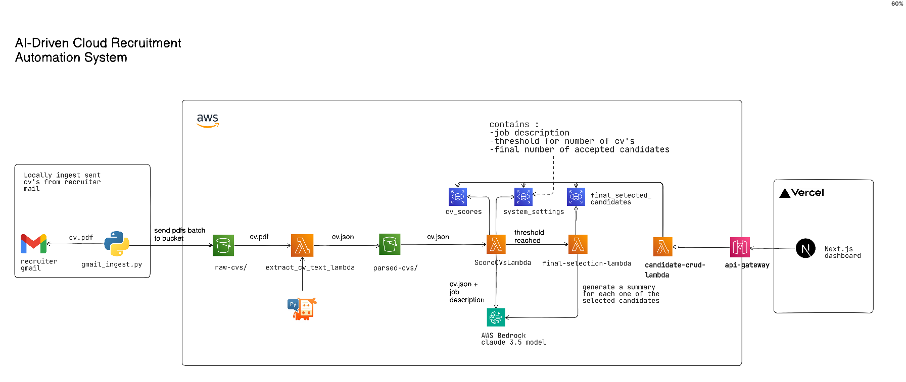
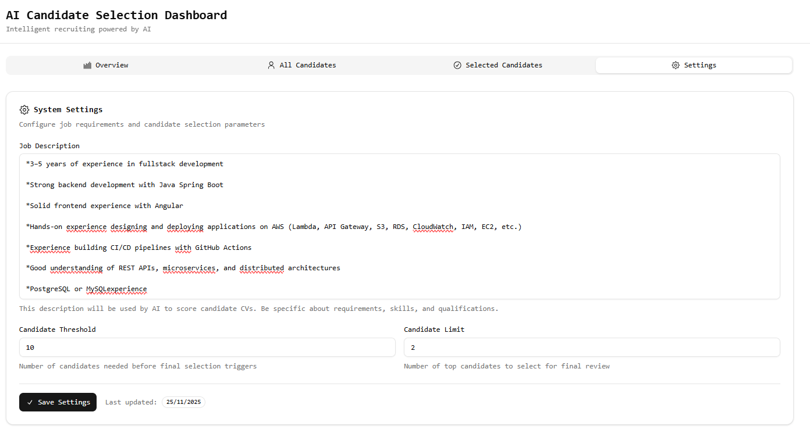
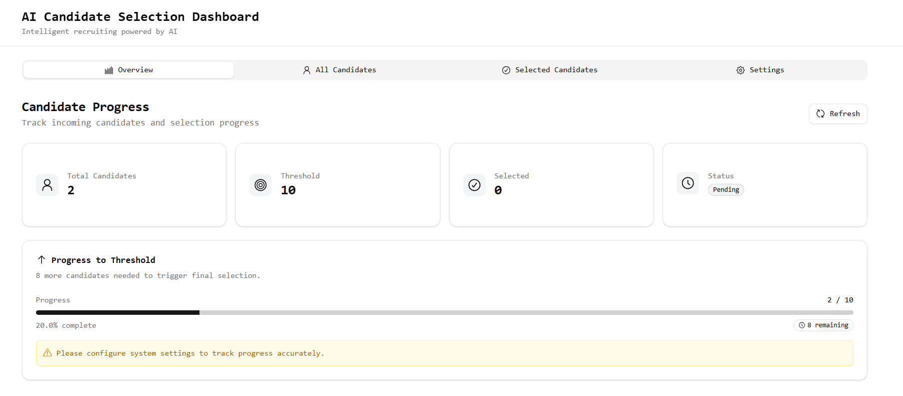
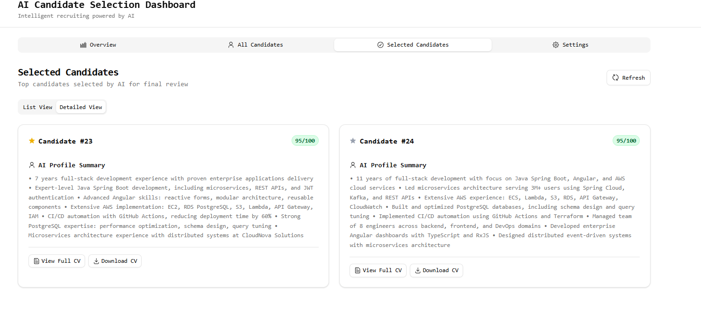
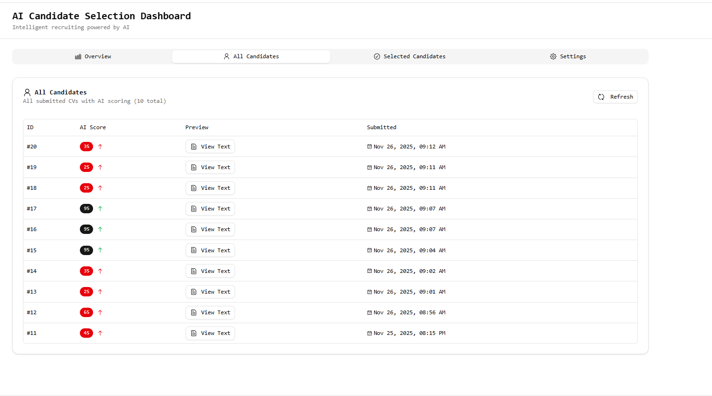

# AI Cloud Recruitment Automation System

This project is an end-to-end automated pipeline that ingests CVs from Gmail, stores them in AWS S3, evaluates each candidate using AI, and selects the top profiles based on recruiter-defined criteria. The system is fully serverless and cloud-native.

Deployed app Link : https://ai-driven-cloud-recruitment-automation-system-r748tcy5s.vercel.app/

## Features
- Automated Gmail ingestion script that downloads CV attachments into S3
- Event-driven workflow using AWS Lambda and S3 triggers
- AI-based CV scoring using AWS Bedrock with Claude 3.5
- Configurable system settings: job description, maximum accepted CVs, and number of final selected candidates
- Automatic generation of summaries for selected candidates
- Dashboard to monitor progress and review final selections

## Architecture
The following diagram provides an overview of the architecture:

## System Settings
Recruiters define the job description and selection constraints through an interface.

## Dashboard
Real-time monitoring of the ingestion and evaluation pipeline.

## Selected Candidates
Final selected candidates and autogenerated summaries are displayed in a dedicated view.

## All Candidates
View of all candidates in a table format.

